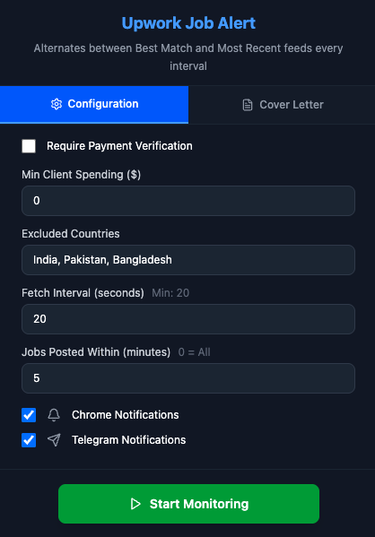

# Upwork Job Alert Extension

A Chrome extension that monitors new jobs on Upwork using their GraphQL API and sends notifications via Chrome notifications and Telegram bot. Now includes a built-in cover letter manager for quick job applications.

## Features

- 🔍 Real-time job monitoring using Upwork's GraphQL API
- 📱 Chrome notifications with sound alerts
- 💬 Telegram notifications support
- 📝 **Quick Cover Letter Manager** - Store and instantly copy cover letters for fast job applications
- 🎯 Advanced filtering options:
  - Payment verification requirement
  - Minimum client spending
  - Excluded countries
  - Maximum job age (in minutes)
- 🔗 Click notifications to open job directly on Upwork


### Extension Popup



## Setup

### 1. Environment Variables

Create a `.env` file in the root directory with your Telegram bot credentials:

```env
VITE_BOT_TOKEN=your_bot_token_here
VITE_CHAT_ID=your_chat_id_here
```

### 2. Getting Telegram Bot Credentials

1. **Create a Bot:**

   - Message [@BotFather](https://t.me/BotFather) on Telegram
   - Send `/newbot` and follow the instructions
   - Copy the bot token

2. **Get Chat ID:**
   - Start a conversation with your bot
   - Send a message to your bot
   - Visit `https://api.telegram.org/bot<YOUR_BOT_TOKEN>/getUpdates`
   - Find your chat ID in the response

### 3. Installation

```bash
# Install dependencies
npm install

# Build extension
npm run build

# Load extension in Chrome
# 1. Go to chrome://extensions/
# 2. Enable "Developer mode"
# 3. Click "Load unpacked"
# 4. Select the `dist` folder
```

## Usage

### Job Monitoring

1. Click "Start Monitoring" to begin job monitoring
2. The extension will automatically fetch new jobs based on your configured interval
3. When new jobs match your filters, you'll receive notifications
4. Click on Chrome notifications to open the job directly on Upwork
5. Click "Stop Monitoring" to pause the extension

### Quick Cover Letter Manager

1. **Navigate to Cover Letters Tab** - Click on the "Cover Letters" tab in the extension popup
2. **Create Cover Letter Templates** - Click "Add Cover Letter" to store your go-to cover letters
3. **Instant Copy** - Click the copy button (📋) to instantly copy any cover letter to your clipboard
4. **Fast Application** - Switch to Upwork and paste (Ctrl+V) directly into the proposal field
5. **Manage Templates** - Edit or delete templates as needed


## Configuration Options

- **Fetch Interval**: How often to check for new jobs (seconds)
- **Payment Verified**: Only show jobs from payment-verified clients
- **Min Client Spending**: Minimum amount client must have spent on Upwork
- **Excluded Countries**: Countries to exclude from job results
- **Max Job Age**: Only show jobs posted within specified minutes
- **Telegram Notifications**: Enable/disable Telegram notifications
- **Chrome Notifications**: Enable/disable Chrome notifications 
