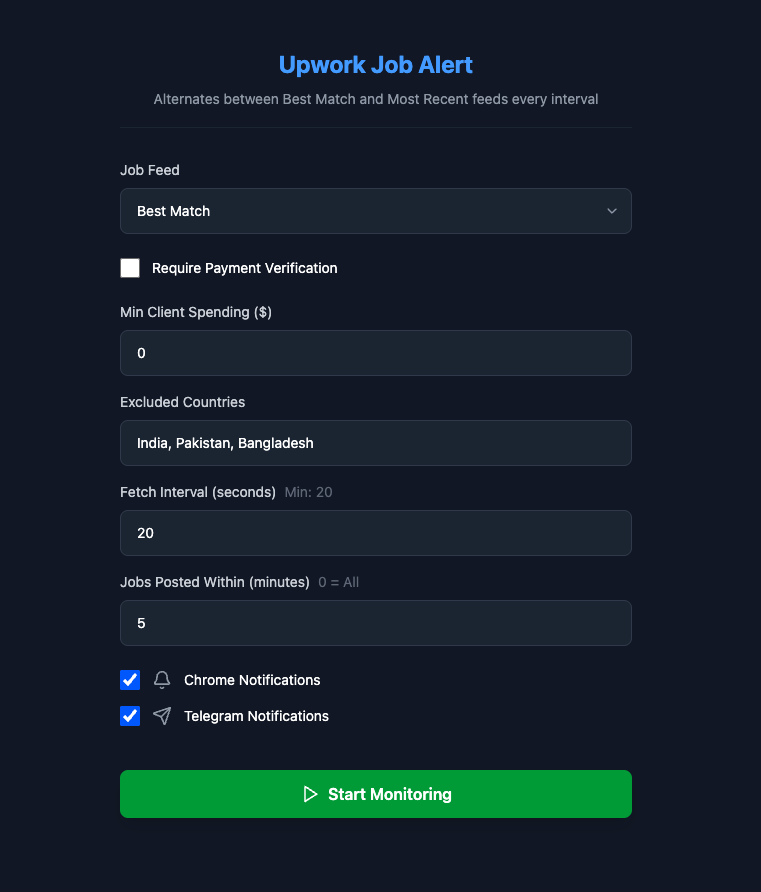

# Upwork Job Alert Extension

A Chrome extension that monitors new jobs on Upwork using their GraphQL API and sends notifications via Chrome notifications and Telegram bot.

## Features

- Real-time job monitoring using Upwork's GraphQL API
- Three job feed options: Best Match, Most Recent, and My Feed
- Chrome notifications with sound alerts
- Telegram notifications support
- Advanced filtering options:
  - Payment verification requirement
  - Minimum client spending
  - Excluded countries
  - Maximum job age (in minutes)
- Click notifications to open job directly on Upwork

### Extension Page



## Setup

### 1. Environment Variables

Create a `.env` file in the root directory with your Telegram bot credentials:

```env
VITE_BOT_TOKEN=your_bot_token_here
VITE_CHAT_ID=your_chat_id_here
```

### 2. Getting Telegram Bot Credentials

1. **Create a Bot:**

   - Message [@BotFather](https://t.me/BotFather) on Telegram
   - Send `/newbot` and follow the instructions
   - Copy the bot token

2. **Get Chat ID:**
   - Start a conversation with your bot
   - Send a message to your bot
   - Visit `https://api.telegram.org/bot<YOUR_BOT_TOKEN>/getUpdates`
   - Find your chat ID in the response

### 3. Installation

```bash
# Install dependencies
npm install

# Build extension
npm run build

# Load extension in Chrome
# 1. Go to chrome://extensions/
# 2. Enable "Developer mode"
# 3. Click "Load unpacked"
# 4. Select the `dist` folder
```

## Usage

### Job Monitoring

1. Select your preferred job feed (Best Match, Most Recent, or My Feed)
2. Configure your filtering options
3. Click "Start Monitoring" to begin job monitoring
4. The extension will check for new jobs at your configured interval using the selected feed
5. When new jobs match your filters, you'll receive notifications
6. Click on Chrome notifications to open the job directly on Upwork
7. Click "Stop Monitoring" to pause the extension

## Configuration Options

- **Job Feed**: Choose between Best Match, Most Recent, or My Feed
- **Fetch Interval**: How often to check for new jobs (seconds)
- **Payment Verified**: Only show jobs from payment-verified clients
- **Min Client Spending**: Minimum amount client must have spent on Upwork
- **Excluded Countries**: Countries to exclude from job results
- **Max Job Age**: Only show jobs posted within specified minutes
- **Telegram Notifications**: Enable/disable Telegram notifications
- **Chrome Notifications**: Enable/disable Chrome notifications
